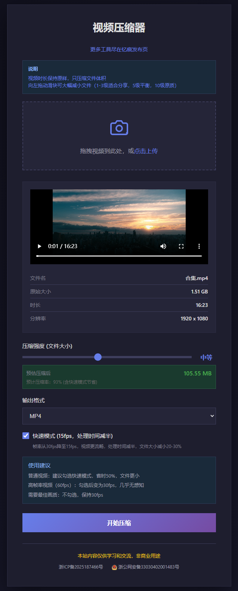

# 视频压缩器

一款纯前端实现的视频压缩工具，无需上传服务器，保护隐私，快速压缩。

演示地址：https://videozip.937788.xyz/

## 功能特点

- 纯前端处理：视频压缩在浏览器本地完成，不上传服务器，保护隐私
- 支持格式：MP4（默认）、WebM
- 多级压缩：可滑块调节压缩比例
- 快速模式：降低帧率至15fps，压缩速度提升50%，文件体积减少25%
- 实时预估：选择压缩级别时实时显示预估文件大小
- 保留时长：仅压缩文件大小，不改变视频时长
- 深色主题：护眼夜间模式设计

## 使用方法

1. 点击上传区域选择视频文件
2. 调节压缩级别滑块（数值越大压缩率越高）
3. 选择输出格式（MP4/WebM）
4. 勾选"快速模式"可加速处理（可选）
5. 点击"开始压缩"按钮
6. 等待处理完成（处理时间约等于视频时长）
7. 下载压缩后的视频

## 快速模式

启用快速模式后：
- 帧率从30fps降至15fps
- 处理速度提升约50%
- 文件体积再减少约25%
- 适合对画面流畅度要求不高的场景

## 适用场景

- 临时应急压缩：打开网页即用，无需安装软件。适合在网吧、公司电脑、他人设备上临时处理视频。

- 隐私敏感内容：视频全程在本地浏览器处理，不上传任何服务器。适合个人证件视频、内部会议录像、私密素材等。

- 网络环境受限：不需要下载几百 MB 的专业软件，也不需要上传大文件到在线工具。适合网速慢、流量有限、离线环境。

- 极致体积优先：低码率下画面结构能保住，配合自动降分辨率，适合"能看清就行"的场景。如微信发送、论坛附件、邮件传输。

- 非专业用户：没有复杂参数，滑块一拉就开始。适合长辈、行政人员、偶尔压缩视频的普通用户。

- 跨平台快速分享：输出 MP4/WebM 浏览器直接兼容，无需考虑解码器。适合网页嵌入、即时通讯发送。

## 不适用场景

- 画质优先的存档：浏览器编码器效率低，同体积下画质不如专业工具。

- 批量处理大量文件：浏览器单线程，逐帧绘制极慢。

- 特定编码格式要求：只能输出 MP4/WebM，无法指定 H.265/AV1/ProRes 等。

- 精确码率控制：只能粗略设比特率，无法做 2-Pass、VBR 精细控制。

- 音频质量要求高：音频随视频重新录制，码率不可控。

- 长视频（>30分钟）：逐帧处理时间极长，浏览器可能崩溃。

## 技术说明

- 使用 HTML5 Canvas + MediaRecorder API 进行视频压缩
- 无需服务器，完全浏览器端处理
- 支持的浏览器：Chrome、Firefox、Edge 等现代浏览器

## 截图

